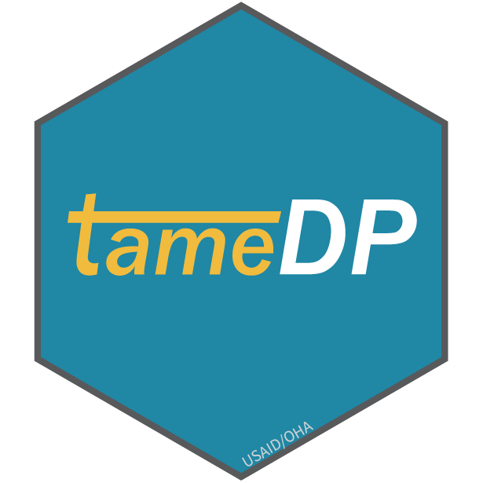

```{r setup, include=FALSE}
knitr::opts_chunk$set(echo = TRUE)
```

## Introduction

This is the third session in the series of R Trainings for the PEPFAR/Mozambique team in September 2022.

This tutorial is adapted from the [coRps R Building Blocks Series (RBBS)](https://usaid-oha-si.github.io//learn/categories/#rbbs).

In order to make the most of this training series, participants should have a number of account setup and software pre-configured so you can actively participate during the sessions. Please ensure you have RStudio, RTools and R installed on your device prior to this session, as well as Git and Github Desktop.

- Learning Objectives:
  - Learn about the intuition between creating R packages for our team’s workflow
  - Overview of OHA's R Package Environment
  - Deep Dive into specific packages that are useful to your workflow
  
### Why did we decide to build R packages for our work?

In the beginning of our office's journey with R, the group of R user's grew from a team of 1 person to a group of people using R for their day to day analytics and wrangling. AS collaboration and automation continued to increase, the team felt the need to automate code and workflows that were being consistently utilized to both save time and free up headspace for future analytics.

Another critical benefit of using packages is that it lowers the barrier to entry to using R, especially when working with PEPFAR data. Having a standard set of tools that are accessibile to all, with thorough documentation of the functions and use cases, significantly alleviates the burden of learning how to work with PEPFAR data in R.

And finally, PEPFAR's data streams operate on predictable cycles, of mostly quarterly/monthly data - using packages meant that we didn't have to keep reinventing the wheel each quarter, and could instead automate tasks every cycle.

- TL;DR - R packages helped us to:
  - Standardize workflows, better consistency
  - Improve reproducibility and efficiency
  - Make work more approachable
  
#### Load Libraries

```{r}
library(tidyverse) #install.packages("tidyverse")
library(scales)
library(glitr) #remotes::install_github("USAID-OHA-SI/glitr", build_vignettes = TRUE)
library(glamr)
library(gophr)
library(grabr)
library(tameDP)
```

## Closer Look at Core OHA R Packages

### glamr
#### 

**Motivation:**
Utility function package to make it easier to optimize the teams workflow when working with PEPFAR data

- Some helpful functions:
  - `glamr::si_setup()` - sets up standard project setup
  - `glamr::si_paths()` - creates standard folder paths
  - `glamr::load_secrets()` - loads stored credentials
  - `glamr::return_latest()` - returns the latest file in a folder and checks for a pattern that is specified, if so
  
```{r, eval = FALSE}
glamr::si_setup()
```  
```{r}
glamr::si_path() #let's set up this path if we havent already to route to a Data folder
glamr::load_secrets()

glamr::si_path() %>% 
  glamr::return_latest("Mozambique")
```
### gophr
#### 
 
**Motivation:**
Utility function package to optimize working with the MER Structured Dataset in R

- Some helpful functions:
  - `gophr::read_msd()` - imports MER dataset from .txt and coverts to .rds file
  - `gophr::reshapse_msd()` - reshapes MSD long or wide
  - `gophr::clean_*()` - cleans up data in specific areas (`clean_agency()`, `clean_indicator()`, etc.)
  - `gophr::source_info()` - extracts MSD source information
  
Let's work through a quick example of putting `glamr` and `gophr` together - let's say we wanted to work with the latest PSNU by IM MER Structured Dataset for Mozambique. I am going to pull that down from Panorama (this can also be automated using an R package for API calls called `grabr`) and save this to the data folder that my `si_path()` routes to. This will be the folder that I save all of  my MSDs in.
```{r, echo = FALSE}
df_msd <- glamr::si_path() %>% #grab data folderpath
  glamr::return_latest("MER_Structured_Datasets_PSNU_IM_FY20-23_20220812_v1_1_Mozambique") %>% #return latest file to match the pattern specified
  gophr::read_msd() #read the MSD in to R

```

Now, let's try to put this all together. We have our MSD loaded, so now we can draw on some of our tidyverse skills to work answer some analytic questions.

- **Question**:
  - Want to identify TX_CURR Total Numerator by funding agency and prime partner
  - in FY22 by quarter
  - in Sofala province
  
First, let's inspect our data. I am going to do some basic counts to show the utility of the `clean_*()` functions in `gophr`.

```{r}
df_msd %>% 
  count(funding_agency) #notice how we get HHS/CDC and HHS/HRSA and have some inconsistent naming patterns

#we can correct this by using the clean_agency() function
df_msd %>% 
  gophr::clean_agency() %>% 
  count(funding_agency)
  
```

Spot the difference? Small tweaks like this can b incredibly valuable in your data wrangling. Now, let's apply what we know about the tidyverse to try to answer the question above.

Let's build our filters first:
```{r, eval = FALSE}

# We know we want TX_CURRdata only for USAID and CDC in Sofala in FY22, and standardizeddisaggregate =Total Numerator

# Dont forward to filter on total numerator!
df_msd %>% 
  gophr::clean_agency() %>% 
  filter(snu1 == "Sofala",
         fiscal_year == 2022,
         funding_agency %in% c("CDC", "USAID"),
         indicator == "TX_CURR",
         standardizeddisaggregate == "Total Numerator")
```

Now that we have all the filters we need, let's get to grouping and summarizing! Notice, since I want to summarize across all the variables in the MSD that represent quarters, I will use `summarize(across(starts_with("qtr")))` as a series of heper functions.

```{r, eval = FALSE}
df_msd %>% 
  gophr::clean_agency() %>% 
  filter(snu1 == "Sofala",
         fiscal_year %in% c(2021, 2022),
         funding_agency %in% c("CDC", "USAID"),
         indicator == "TX_CURR",
         standardizeddisaggregate == "Total Numerator") %>% 
  group_by(snu1, fiscal_year, indicator, standardizeddisaggregate, funding_agency, prime_partner_name) %>% 
  summarise(across(starts_with("qtr"), sum, na.rm = TRUE), .groups = "drop") 

```

We're almost there! Now that our data is summarize, we want to reshape this long so we can more easily filter for the periods we are interested in. We'll use `gophr::reshape_msd()` to achieve this.

```{r, eval = FALSE}
df_msd %>% 
  gophr::clean_agency() %>% 
  filter(snu1 == "Sofala",
         fiscal_year %in% c(2021, 2022),
         funding_agency %in% c("CDC", "USAID"),
         indicator == "TX_CURR",
         standardizeddisaggregate == "Total Numerator") %>% 
  group_by(snu1, fiscal_year, indicator, standardizeddisaggregate, funding_agency, prime_partner_name) %>% 
  summarise(across(starts_with("qtr"), sum, na.rm = TRUE), .groups = "drop") %>% 
  gophr::reshape_msd()
```

Now we have stacked data with the period as a variable in the dataset! This is just one example of the numerous different things we can do when we combine the `tidyverse` and the OHA packages.

### tameDP
#### 

**Motivation:**
Easily import PSNUxIM targets from Data Pack and make tidy/usable

- Some helpful functions:
  - `tameDP::tame_dp()` - export tidy data from Data Pack
  `tameDP::tame_plhiv()` - export TIDY PLHIV data from Data Pack
  
```{r, eval = FALSE}
library(tameDP)

#datapack file path
path <- "C:/Users/ksrikanth/Documents/Datapack/Mozambique_datapack_Finalized_20220415.xlsx"


#read in Data Pack & tidy
df_dp <- tame_dp(path)

#grab PSNUxIM tab
df_dp_mech <- tame_dp(path, type = "PSNUxIM")

#grab PLHIV tab
df_plhiv <- tame_dp(path, type = "PLHIV")

head(df_dp)

```

### grabR
#### 

**Motivation:**
Extend glamr utilities functions to API utility functions to extract from DATIM and Pano

- Some helpful functions:
  - `pano_elements()` - extract data element details from html content
  - `datim_dimesions()` - get PEPFAR/DATIM dimensions
  - `get_*()` - extract various orgunit hierarchy metadata from DATIM

Let's say I wanted to get the orgunituid for each OU. I could use the function `grabr::get_orguids()` to grab ever uid at the specific level I determine. In this case, I'll specify level = 3 to get the OU level.

```{r}
grabr::get_orguids(level = 3)
```

### glitr
#### 

**Motivation:**
Allows user to easily adorn plots created in ggplot() in a standardized SI style

- Some helpful functions:
  - `glitr::si_style()` - standard SI styles applied to plots
  - `glitr::si_palettes()` - color palette developed by OHA/SIEI for use

We'll cover visualization more later, but here's a snapshot of OHA/SIEI's base color palette that was developed.
```{r}
show_col(si_palettes$siei_pairs)
```

### gisr
#### 

**Motivation:**
OHA geospatial analytics utilities package

- Some helpful functions:
  - `gisr::get_basemap()` - pulls basemap
  - `gisr::extract_boundaries()` - extract PEPFAR Orgunit Boundaries
  
### gagglr
#### 

**Motivation:**
Similar to the tidyverse, this package provides a check to users to ensure they have the latest versions of the core OHA utility packages

- Some helpful functions:
  - `gagglr::oha_check()` - check for OHA package updates
  - `gagglr::oha_update()`- update OHA packages

```{r}
library(gagglr)

#run a check on the updates needed for OHA packages
gagglr::oha_check()
```

## Additional OHA Packages

### mindthegap
#### 

**Motivation:**
Package to clean, process, and tidy annual UNAIDS estimates for ease of data access

### selfdestructin5
#### 

**Motivation:**
SI utilities package to create Mission Director Briefer Tables from MSDs that summarize results and targets

### COVIDutilities
#### 

**Motivation:**
Automates data fetching exercises and standardizes the COVID-19 data to be compatible with other PEPFAR dataset

### cascade
#### 

**Motivation:**
Generate automated cascade plots for various analytic use cases

